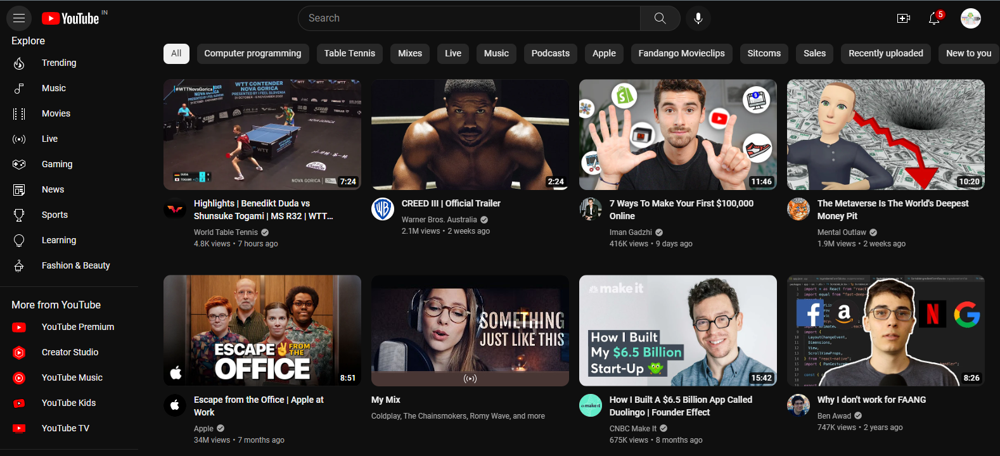
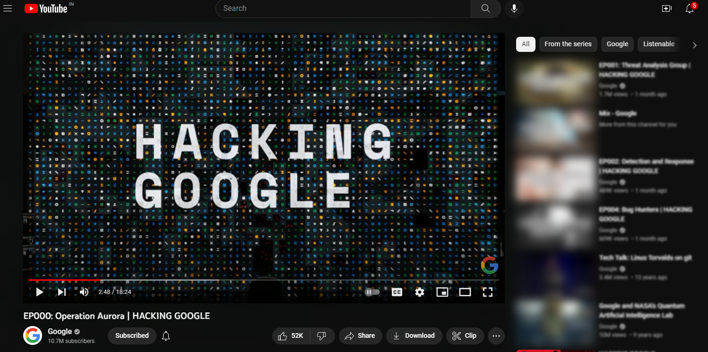
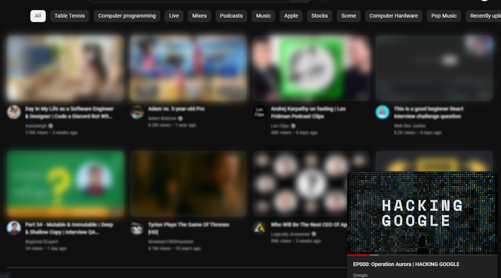

# YouTube Focus Mode
A Simple Chrome Extension to blur out YouTube video thumbnails &amp; comments to enhance focus &amp; lower distractions.

Removing extra clutter from a page allows our minds to concentrate on the most relevant information. Focus mode offers how to hides distracting videos and comments while you are watching a video. 

## Intro

An average every person spend at least 1.5 hours a day in YouTube and it is becoming the most dominant streaming platform for learn cool new things. In the recent years the usage of YouTube has become widely popular in developing countries because of easy and low cost access to internet. With the wide adoption of online everywhere, if you’re planning to develop your skills or want to learn new technology, tools or any form of contents and YouTube is the first choice for learning. 

If I say YouTube may be ruining your career or wasting your own time on a day-to-day basis. Even at the risk of sounding like massive hypocrite I still I have a strong point,

## Analysis Paralysis

_Too much information out there, difficult to differentiate between high and low quality videos, hard to know what content is right for you._

When you start a video to watch, sometimes you may not continue to watch a video till end because you got bored or it's difficult to digest information said in the video. **Also there's suggestion list on the right side which includes relavant topic video’s shown up based on category, same channel video’s or personalized suggestions from YouTube**. Often these information may not be the best and will distract us from what we focused to pursue on that particular time.

If you're in that stage and looking for a solution, then you've came to right place. Please follow the **How to use** section and switch to focus mode when you're watching a video. 

## How to use

If you want to test out this extension, simply download this repo as a zip folder and then open up the "Extensions" option from Chome's settings (you can find it under the "More Tools" menu option) and load the unzipped folder containing the files.

## Preview

 

 

